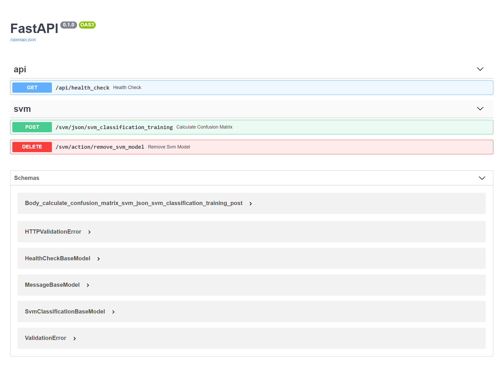
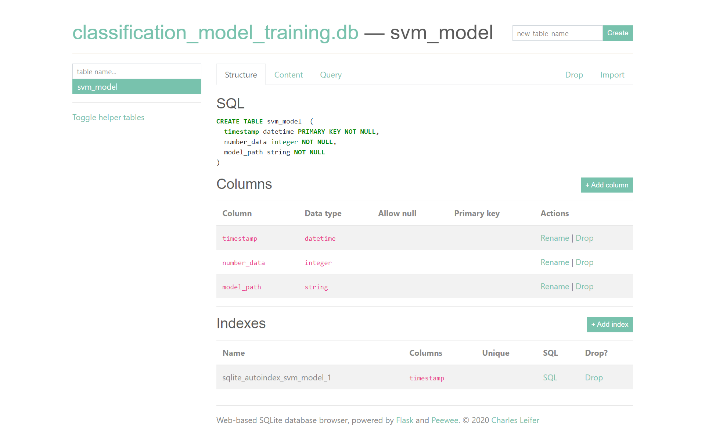

# service-ml-model-training-evaluation
service-ml-model-training-evaluation

# service-restfulapi-evaluation
You can use this service to training the model.

- [x] SVM model

## How to use it?

- Please use docker to start the service.
```bash
$ cd docker
$ ./docker_build_service.sh
$ ./docker_start_service.sh
```

- If you want to remove the service.
```bash
$ ./docker_remove_service.sh
```

- Swagger api website:

http://{ip-address}:8000/docs



- sqlite website visualization:

http://{ip-address}:8080/



## Version, author and other information:
- See the relation information in [setup file](setup.py).

## License
- See License file [here](LICENSE).
